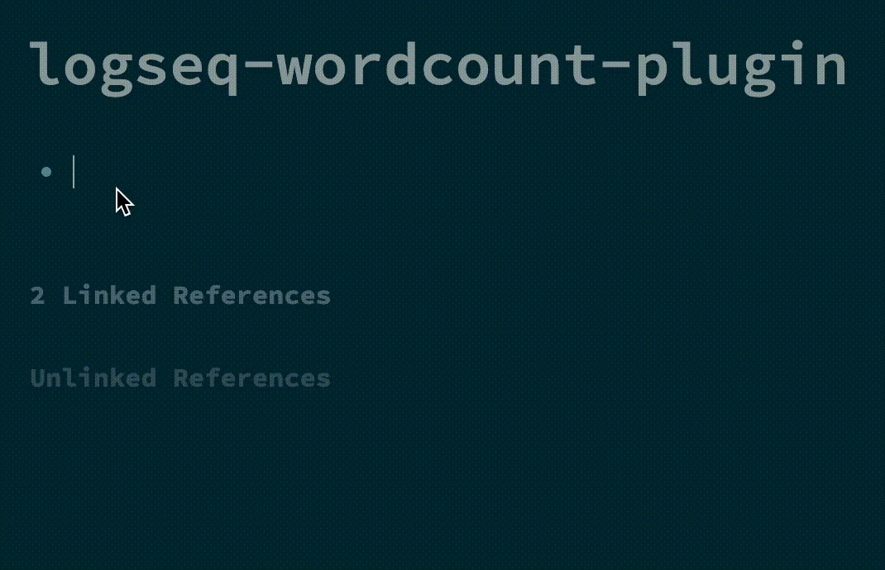

> v1.4 now allows the counting to be done on the homepage too!

<a href="https://www.buymeacoffee.com/hkgnp.dev" target="_blank"></a>

# Introduction



# Usage

Use `/wordcount`. It will then count the number of words below this parent block. This supports an unlimited number of nested blocks.

You can use more than 1 word counter in a single page. Just prefix the blocks you would like to count with another `/wordcount`.

It also supports counting sentences that have both English and Chinese/ Japanese words. E.g. `敏捷的棕色狐狸跳过了懒狗 is a funny phrase` returns 16 words.

You can also use `/character count` to count the number of characters (including spaces) instead of words.

Happy counting!

# Styling the Wordcount button

You can style the wordcount button using the class `.wordcount-btn`. Simply add it into your `custom.css`.

Example:

```
.wordcount-btn {
    border-color: red;
    font-size: 2em;
}
```

# Migrating from Roam

Roam uses `{{word-count}}`. All you need to do is to replace each instance of `{{word-count}}` with `{{renderer :wordcount_abc123}}` (abc123 can be any other string you want). You can also a use a terminal command (in MacOS or Linux) to do so. In terminal, navigate to the folder (e.g. pages) and run the following command.

```
find . -type f -name '*.md' -exec sed -i '' s/word-count/renderer\ :wordcount_abc123/g {} +
```

# Installation

Install from the marketplace.

# Credits

[pengx17](https://github.com/pengx17) for his suggestions and [Ken Lee](https://stackoverflow.com/users/11854986/ken-lee) for his word counting algorithm.
